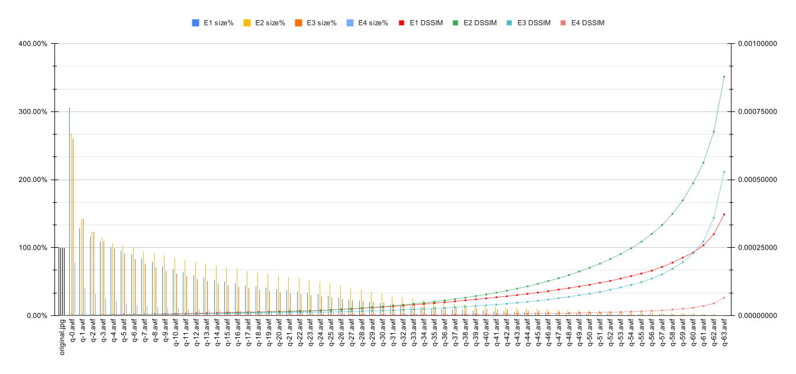

# AVIF quality comparison

[example1/original.jpg](https://unsplash.com/photos/jTeQavJjBDs) • credits: Jeff Sheldon, via [Unsplash](https://unsplash.com)

[example2/original.jpg](https://unsplash.com/photos/56xpL9-x2A4) • credits: note thanun, via [Unsplash](https://unsplash.com)

[example3/original.jpg](https://unsplash.com/photos/red-and-blue-doodle-artwork-with-black-background-pVq6YhmDPtk) • credits: hao wang, via [Unsplash](https://unsplash.com)

[example4/original.png](https://www.freepik.com/free-vector/wineglasses-alcohol-drinks-set-transparent-poster_3861916.htm) • credits:
macrovector, via [freepik](https://www.freepik.com/)

## AVIF convert
Running the script `encode.sh` encodes original images to `q-$q.avif` files, where `$q` is a variable for setting `cq-level` parameter.

The command is the following:

`avifenc -j all --min 0 --max 63 --minalpha 0 --maxalpha 63 -a end-usage=q -a cq-level=$q -a tune=ssim original.jpg q-$q.avif`

Where the parameters are:
- `-a cq-level=$q`: Constant Quality level. Value can be from 0-63. Lower values mean better quality and greater file size.
- `-j all`: Number of jobs (worker threads, `all` uses all available cores).
- `--min 0`: Min quantizer for color (0-63).
- `--max 63`: Max quantizer for color (0-63).
- `--minalpha 0`: Min quantizer for alpha (0-63).
- `--maxalpha 63`: Max quantizer for alpha (0-63).
- `-a end-usage=q` Rate control mode set to Constant Quality mode.
- `-a tune=ssim`: SSIM as tune the encoder for distortion metric.

## DSSIM
Compiled Kornel Lesiński's [`dssim` library](https://github.com/kornelski/dssim) with AVIF support:

1. `git clone https://github.com/kornelski/dssim.git /tmp/dssim`
1. `cargo build --release --features avif --manifest-path /tmp/dssim/Cargo.toml`
1. `/tmp/dssim/target/release/dssim example1/original.jpg example1/*.avif`
1. `/tmp/dssim/target/release/dssim example2/original.jpg example2/*.avif`
1. `/tmp/dssim/target/release/dssim example3/original.jpg example3/*.avif`
1. `/tmp/dssim/target/release/dssim example4/original.png example4/*.avif`

The tool calculated each `avif` file dissimilarity from the original images.

## Results

| File         |   E1 size | E1 size% |   E1 DSSIM |   E2 size | E2 size% |   E2 DSSIM |   E3 size | E3 size% |   E3 DSSIM |   E4 size | E4 size% |   E4 DSSIM |
|--------------|----------:|---------:|-----------:|----------:|---------:|-----------:|----------:|---------:|-----------:|----------:|---------:|-----------:|
| original.jpg | 1,832,862 |  100.00% | 0.00000000 | 3,440,017 |  100.00% | 0.00000000 | 2,020,087 |  100.00% | 0.00000000 | 2,501,936 |  100.00% | 0.00000000 |
| q-0.avif     | 5,608,016 |  305.97% | 0.00017465 | 9,219,013 |  267.99% | 0.00006591 | 5,256,395 |  260.21% | 0.00019494 | 1,940,541 |   77.56% | 0.00001695 |
| q-1.avif     | 2,350,808 |  128.26% | 0.00019948 | 4,859,779 |  141.27% | 0.00009589 | 2,886,003 |  142.87% | 0.00021186 | 1,041,235 |   41.62% | 0.00002756 |
| q-2.avif     | 2,137,542 |  116.62% | 0.00021586 | 4,238,474 |  123.21% | 0.00011543 | 2,482,796 |  122.91% | 0.00022589 |   785,814 |   31.41% | 0.00003294 |
| q-3.avif     | 1,996,515 |  108.93% | 0.00023554 | 3,938,260 |  114.48% | 0.00014014 | 2,200,418 |  108.93% | 0.00024497 |   624,078 |   24.94% | 0.00003908 |
| q-4.avif     | 1,840,268 |  100.40% | 0.00026059 | 3,685,180 |  107.13% | 0.00015821 | 1,994,946 |   98.76% | 0.00026460 |   528,268 |   21.11% | 0.00004491 |
| q-5.avif     | 1,756,577 |   95.84% | 0.00031036 | 3,562,627 |  103.56% | 0.00020261 | 1,834,495 |   90.81% | 0.00030249 |   450,637 |   18.01% | 0.00005130 |
| q-6.avif     | 1,658,133 |   90.47% | 0.00035917 | 3,435,751 |   99.88% | 0.00024606 | 1,685,859 |   83.45% | 0.00034150 |   398,980 |   15.95% | 0.00005724 |
| q-7.avif     | 1,536,763 |   83.84% | 0.00043921 | 3,262,133 |   94.83% | 0.00028608 | 1,542,511 |   76.36% | 0.00040194 |   352,008 |   14.07% | 0.00006148 |
| q-8.avif     | 1,440,293 |   78.58% | 0.00049170 | 3,151,035 |   91.60% | 0.00032102 | 1,439,774 |   71.27% | 0.00043619 |   319,914 |   12.79% | 0.00006676 |
| q-9.avif     | 1,340,917 |   73.16% | 0.00056366 | 3,053,867 |   88.77% | 0.00037296 | 1,329,391 |   65.81% | 0.00048589 |   288,707 |   11.54% | 0.00007286 |
| q-10.avif    | 1,256,395 |   68.55% | 0.00064390 | 2,930,470 |   85.19% | 0.00044769 | 1,241,566 |   61.46% | 0.00053314 |   267,311 |   10.68% | 0.00007783 |
| q-11.avif    | 1,180,902 |   64.43% | 0.00071756 | 2,830,000 |   82.27% | 0.00050667 | 1,165,886 |   57.71% | 0.00057728 |   248,783 |    9.94% | 0.00008381 |
| q-12.avif    | 1,097,950 |   59.90% | 0.00080692 | 2,713,799 |   78.89% | 0.00058358 | 1,087,733 |   53.85% | 0.00062803 |   229,339 |    9.17% | 0.00009037 |
| q-13.avif    | 1,033,989 |   56.41% | 0.00089085 | 2,628,864 |   76.42% | 0.00067323 | 1,025,966 |   50.79% | 0.00067557 |   214,944 |    8.59% | 0.00009676 |
| q-14.avif    |   971,522 |   53.01% | 0.00097779 | 2,534,595 |   73.68% | 0.00077245 |   967,005 |   47.87% | 0.00072505 |   202,290 |    8.09% | 0.00010132 |
| q-15.avif    |   922,275 |   50.32% | 0.00104488 | 2,454,398 |   71.35% | 0.00085579 |   914,591 |   45.27% | 0.00077114 |   191,653 |    7.66% | 0.00010748 |
| q-16.avif    |   871,687 |   47.56% | 0.00113375 | 2,369,029 |   68.87% | 0.00095177 |   859,189 |   42.53% | 0.00082935 |   178,643 |    7.14% | 0.00011546 |
| q-17.avif    |   829,122 |   45.24% | 0.00121831 | 2,274,503 |   66.12% | 0.00107020 |   812,992 |   40.25% | 0.00088383 |   170,158 |    6.80% | 0.00012184 |
| q-18.avif    |   789,807 |   43.09% | 0.00130430 | 2,185,941 |   63.54% | 0.00117705 |   772,375 |   38.23% | 0.00093417 |   161,804 |    6.47% | 0.00012772 |
| q-19.avif    |   753,032 |   41.09% | 0.00139719 | 2,115,022 |   61.48% | 0.00128848 |   735,986 |   36.43% | 0.00098242 |   154,716 |    6.18% | 0.00013361 |
| q-20.avif    |   711,184 |   38.80% | 0.00149934 | 2,036,493 |   59.20% | 0.00141220 |   696,047 |   34.46% | 0.00105446 |   146,741 |    5.87% | 0.00013954 |
| q-21.avif    |   676,658 |   36.92% | 0.00158142 | 1,960,429 |   56.99% | 0.00153544 |   664,001 |   32.87% | 0.00110076 |   140,872 |    5.63% | 0.00014732 |
| q-22.avif    |   645,535 |   35.22% | 0.00166758 | 1,890,671 |   54.96% | 0.00159035 |   635,246 |   31.45% | 0.00114810 |   131,727 |    5.27% | 0.00014521 |
| q-23.avif    |   616,962 |   33.66% | 0.00175660 | 1,823,060 |   53.00% | 0.00169885 |   608,589 |   30.13% | 0.00119827 |   126,395 |    5.05% | 0.00015534 |
| q-24.avif    |   581,818 |   31.74% | 0.00187211 | 1,737,401 |   50.51% | 0.00184523 |   578,421 |   28.63% | 0.00125907 |   120,622 |    4.82% | 0.00016189 |
| q-25.avif    |   534,676 |   29.17% | 0.00205190 | 1,618,010 |   47.03% | 0.00205697 |   535,123 |   26.49% | 0.00135154 |   113,188 |    4.52% | 0.00017352 |
| q-26.avif    |   487,690 |   26.61% | 0.00226419 | 1,511,506 |   43.94% | 0.00229647 |   497,876 |   24.65% | 0.00145160 |   106,112 |    4.24% | 0.00018602 |
| q-27.avif    |   443,017 |   24.17% | 0.00247434 | 1,401,255 |   40.73% | 0.00253112 |   465,388 |   23.04% | 0.00154683 |    99,702 |    3.98% | 0.00019783 |
| q-28.avif    |   402,114 |   21.94% | 0.00270015 | 1,298,599 |   37.75% | 0.00276959 |   437,223 |   21.64% | 0.00163895 |    94,686 |    3.78% | 0.00021174 |
| q-29.avif    |   367,356 |   20.04% | 0.00291583 | 1,198,954 |   34.85% | 0.00302583 |   412,093 |   20.40% | 0.00174122 |    90,326 |    3.61% | 0.00022412 |
| q-30.avif    |   337,005 |   18.39% | 0.00313155 | 1,117,114 |   32.47% | 0.00325541 |   389,844 |   19.30% | 0.00183682 |    86,488 |    3.46% | 0.00023649 |
| q-31.avif    |   301,197 |   16.43% | 0.00342845 | 1,017,633 |   29.58% | 0.00362253 |   361,602 |   17.90% | 0.00198315 |    81,210 |    3.25% | 0.00025491 |
| q-32.avif    |   270,442 |   14.76% | 0.00371780 |   926,087 |   26.92% | 0.00397932 |   335,529 |   16.61% | 0.00212805 |    75,974 |    3.04% | 0.00027206 |
| q-33.avif    |   246,250 |   13.44% | 0.00400157 |   852,123 |   24.77% | 0.00433724 |   314,858 |   15.59% | 0.00227105 |    72,657 |    2.90% | 0.00029220 |
| q-34.avif    |   225,048 |   12.28% | 0.00426077 |   789,622 |   22.95% | 0.00469546 |   297,009 |   14.70% | 0.00242082 |    69,090 |    2.76% | 0.00030875 |
| q-35.avif    |   203,975 |   11.13% | 0.00458198 |   723,488 |   21.03% | 0.00514863 |   277,218 |   13.72% | 0.00260518 |    65,230 |    2.61% | 0.00033194 |
| q-36.avif    |   184,942 |   10.09% | 0.00491412 |   666,787 |   19.38% | 0.00561515 |   257,978 |   12.77% | 0.00281794 |    61,919 |    2.47% | 0.00035858 |
| q-37.avif    |   169,804 |    9.26% | 0.00523421 |   620,487 |   18.04% | 0.00607538 |   243,355 |   12.05% | 0.00301268 |    58,839 |    2.35% | 0.00038112 |
| q-38.avif    |   154,956 |    8.45% | 0.00563911 |   575,994 |   16.74% | 0.00660038 |   227,742 |   11.27% | 0.00327889 |    55,823 |    2.23% | 0.00041282 |
| q-39.avif    |   141,909 |    7.74% | 0.00598582 |   535,822 |   15.58% | 0.00717691 |   213,268 |   10.56% | 0.00351862 |    53,038 |    2.12% | 0.00044519 |
| q-40.avif    |   131,204 |    7.16% | 0.00633243 |   501,285 |   14.57% | 0.00775435 |   200,492 |    9.92% | 0.00376308 |    50,412 |    2.01% | 0.00047721 |
| q-41.avif    |   120,275 |    6.56% | 0.00673911 |   466,437 |   13.56% | 0.00844514 |   187,767 |    9.29% | 0.00406272 |    47,909 |    1.91% | 0.00051464 |
| q-42.avif    |   111,408 |    6.08% | 0.00711019 |   437,344 |   12.71% | 0.00912211 |   177,298 |    8.78% | 0.00434587 |    45,719 |    1.83% | 0.00054468 |
| q-43.avif    |   102,903 |    5.61% | 0.00756085 |   407,543 |   11.85% | 0.00992430 |   166,036 |    8.22% | 0.00469760 |    43,588 |    1.74% | 0.00059828 |
| q-44.avif    |    95,669 |    5.22% | 0.00798461 |   382,112 |   11.11% | 0.01073139 |   156,492 |    7.75% | 0.00506330 |    41,712 |    1.67% | 0.00063323 |
| q-45.avif    |    88,190 |    4.81% | 0.00846126 |   356,893 |   10.37% | 0.01168044 |   147,110 |    7.28% | 0.00544948 |    39,843 |    1.59% | 0.00069217 |
| q-46.avif    |    81,671 |    4.46% | 0.00895592 |   333,334 |    9.69% | 0.01269146 |   138,500 |    6.86% | 0.00591325 |    38,305 |    1.53% | 0.00074152 |
| q-47.avif    |    75,825 |    4.14% | 0.00956686 |   312,619 |    9.09% | 0.01372644 |   130,581 |    6.46% | 0.00637055 |    36,605 |    1.46% | 0.00079964 |
| q-48.avif    |    70,397 |    3.84% | 0.01012459 |   292,021 |    8.49% | 0.01490846 |   122,274 |    6.05% | 0.00689154 |    35,078 |    1.40% | 0.00089081 |
| q-49.avif    |    65,094 |    3.55% | 0.01070428 |   272,833 |    7.93% | 0.01622062 |   115,063 |    5.70% | 0.00748383 |    33,608 |    1.34% | 0.00096179 |
| q-50.avif    |    60,194 |    3.28% | 0.01132495 |   255,223 |    7.42% | 0.01757990 |   108,643 |    5.38% | 0.00807132 |    32,227 |    1.29% | 0.00104929 |
| q-51.avif    |    55,316 |    3.02% | 0.01207977 |   238,444 |    6.93% | 0.01909053 |   102,199 |    5.06% | 0.00871745 |    30,952 |    1.24% | 0.00115343 |
| q-52.avif    |    51,205 |    2.79% | 0.01276578 |   222,697 |    6.47% | 0.02080486 |    96,030 |    4.75% | 0.00946788 |    29,581 |    1.18% | 0.00122032 |
| q-53.avif    |    47,094 |    2.57% | 0.01361508 |   207,007 |    6.02% | 0.02268777 |    89,965 |    4.45% | 0.01035214 |    28,508 |    1.14% | 0.00132629 |
| q-54.avif    |    43,258 |    2.36% | 0.01451707 |   192,636 |    5.60% | 0.02473018 |    84,358 |    4.18% | 0.01126440 |    27,320 |    1.09% | 0.00144504 |
| q-55.avif    |    39,640 |    2.16% | 0.01546033 |   177,709 |    5.17% | 0.02713804 |    78,753 |    3.90% | 0.01232024 |    26,332 |    1.05% | 0.00156221 |
| q-56.avif    |    36,188 |    1.97% | 0.01653103 |   163,094 |    4.74% | 0.03000666 |    73,714 |    3.65% | 0.01357462 |    25,295 |    1.01% | 0.00171353 |
| q-57.avif    |    32,856 |    1.79% | 0.01788240 |   148,790 |    4.33% | 0.03326768 |    68,409 |    3.39% | 0.01511803 |    24,138 |    0.96% | 0.00190282 |
| q-58.avif    |    29,384 |    1.60% | 0.01945924 |   134,026 |    3.90% | 0.03735460 |    62,902 |    3.11% | 0.01715196 |    23,054 |    0.92% | 0.00219556 |
| q-59.avif    |    26,385 |    1.44% | 0.02129385 |   119,241 |    3.47% | 0.04237454 |    57,413 |    2.84% | 0.01963627 |    21,939 |    0.88% | 0.00250446 |
| q-60.avif    |    23,407 |    1.28% | 0.02317474 |   104,058 |    3.02% | 0.04863330 |    52,354 |    2.59% | 0.02287584 |    20,573 |    0.82% | 0.00287790 |
| q-61.avif    |    20,464 |    1.12% | 0.02582241 |    90,311 |    2.63% | 0.05624411 |    46,953 |    2.32% | 0.02728882 |    19,480 |    0.78% | 0.00353268 |
| q-62.avif    |    16,915 |    0.92% | 0.02993757 |    74,304 |    2.16% | 0.06758287 |    39,874 |    1.97% | 0.03595811 |    17,822 |    0.71% | 0.00446529 |
| q-63.avif    |    13,218 |    0.72% | 0.03720529 |    55,747 |    1.62% | 0.08783640 |    31,609 |    1.56% | 0.05285349 |    16,060 |    0.64% | 0.00656578 |

## Resources
- https://github.com/AOMediaCodec/libavif/blob/main/doc/avifenc.1.md
- https://github.com/AOMediaCodec/libavif/blob/main/apps/avifenc.c
- https://github.com/mozilla/aom/blob/master/aomenc.c
- https://web.dev/compress-images-avif/#create-an-avif-image-with-default-settings
- https://www.ctrl.blog/entry/webp-avif-comparison.html
- https://www.reddit.com/r/AV1/comments/o7s8hk/high_quality_encoding_of_avif_images_using/
