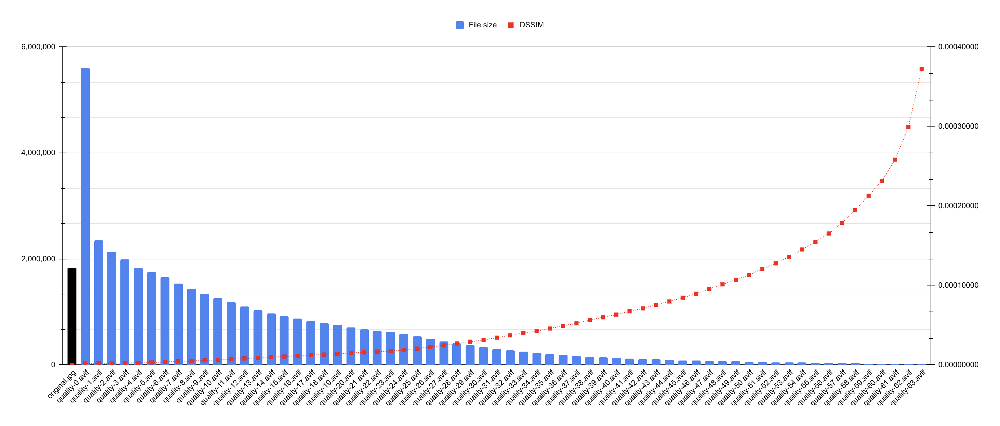

# AVIF quality comparison

[original.jpg](https://unsplash.com/photos/jTeQavJjBDs) • credits: Jeff Sheldon, via [Unsplash](https://unsplash.com)

## AVIF convert
Running the script `encode.sh` encodes `original.jpg` to `quality-$q.avif` files, where `$q` is a variable for setting `cq-level` parameter.

The command is the following:

`avifenc -j all --min 0 --max 63 --minalpha 0 --maxalpha 63 -a end-usage=q -a cq-level=$q -a tune=ssim original.jpg quality-$q.avif`

Where the parameters are:
- `-a cq-level=$q`: Constant Quality level. Value can be from 0-63. Lower values mean better quality and greater file size.
- `-j all`: Number of jobs (worker threads, `all` uses all available cores).
- `--min 0`: Min quantizer for color (0-63).
- `--max 63`: Max quantizer for color (0-63).
- `--minalpha 0`: Min quantizer for alpha (0-63).
- `--maxalpha 63`: Max quantizer for alpha (0-63).
- `-a end-usage=q` Rate control mode set to Constant Quality mode.
- `-a tune=ssim`: SSIM as tune the encoder for distortion metric.

## DSSIM
Compiled Kornel Lesiński's [`dssim` library](https://github.com/kornelski/dssim) with AVIF support:

1. `git clone https://github.com/kornelski/dssim.git /tmp/dssim`
1. `cargo build --release --features avif --manifest-path /tmp/dssim/Cargo.toml`
1. `/tmp/dssim/target/release/dssim original.jpg *.avif`

The tool calculated each `avif` file dissimilarity from the original image.

## Results

| File            |   File size |        DSSIM |
|-----------------|------------:|-------------:|
| original.jpg    | `1,832,862` | `0.00000000` |
| quality-0.avif  | `5,608,016` | `0.00017465` |
| quality-1.avif  | `2,350,808` | `0.00019948` |
| quality-2.avif  | `2,137,542` | `0.00021586` |
| quality-3.avif  | `1,996,515` | `0.00023554` |
| quality-4.avif  | `1,840,268` | `0.00026059` |
| quality-5.avif  | `1,756,577` | `0.00031036` |
| quality-6.avif  | `1,658,133` | `0.00035917` |
| quality-7.avif  | `1,536,763` | `0.00043921` |
| quality-8.avif  | `1,440,293` | `0.00049170` |
| quality-9.avif  | `1,340,917` | `0.00056366` |
| quality-10.avif | `1,256,395` | `0.00064390` |
| quality-11.avif | `1,180,902` | `0.00071756` |
| quality-12.avif | `1,097,950` | `0.00080692` |
| quality-13.avif | `1,033,989` | `0.00089085` |
| quality-14.avif |   `971,522` | `0.00097779` |
| quality-15.avif |   `922,275` | `0.00104488` |
| quality-16.avif |   `871,687` | `0.00113375` |
| quality-17.avif |   `829,122` | `0.00121831` |
| quality-18.avif |   `789,807` | `0.00130430` |
| quality-19.avif |   `753,032` | `0.00139719` |
| quality-20.avif |   `711,184` | `0.00149934` |
| quality-21.avif |   `676,658` | `0.00158142` |
| quality-22.avif |   `645,535` | `0.00166758` |
| quality-23.avif |   `616,962` | `0.00175660` |
| quality-24.avif |   `581,818` | `0.00187211` |
| quality-25.avif |   `534,676` | `0.00205190` |
| quality-26.avif |   `487,690` | `0.00226419` |
| quality-27.avif |   `443,017` | `0.00247434` |
| quality-28.avif |   `402,114` | `0.00270015` |
| quality-29.avif |   `367,356` | `0.00291583` |
| quality-30.avif |   `337,005` | `0.00313155` |
| quality-31.avif |   `301,197` | `0.00342845` |
| quality-32.avif |   `270,442` | `0.00371780` |
| quality-33.avif |   `246,250` | `0.00400157` |
| quality-34.avif |   `225,048` | `0.00426077` |
| quality-35.avif |   `203,975` | `0.00458198` |
| quality-36.avif |   `184,942` | `0.00491412` |
| quality-37.avif |   `169,804` | `0.00523421` |
| quality-38.avif |   `154,956` | `0.00563911` |
| quality-39.avif |   `141,909` | `0.00598582` |
| quality-40.avif |   `131,204` | `0.00633243` |
| quality-41.avif |   `120,275` | `0.00673911` |
| quality-42.avif |   `111,408` | `0.00711019` |
| quality-43.avif |   `102,903` | `0.00756085` |
| quality-44.avif |    `95,669` | `0.00798461` |
| quality-45.avif |    `88,190` | `0.00846126` |
| quality-46.avif |    `81,671` | `0.00895592` |
| quality-47.avif |    `75,825` | `0.00956686` |
| quality-48.avif |    `70,397` | `0.01012459` |
| quality-49.avif |    `65,094` | `0.01070428` |
| quality-50.avif |    `60,194` | `0.01132495` |
| quality-51.avif |    `55,316` | `0.01207977` |
| quality-52.avif |    `51,205` | `0.01276578` |
| quality-53.avif |    `47,094` | `0.01361508` |
| quality-54.avif |    `43,258` | `0.01451707` |
| quality-55.avif |    `39,640` | `0.01546033` |
| quality-56.avif |    `36,188` | `0.01653103` |
| quality-57.avif |    `32,856` | `0.01788240` |
| quality-58.avif |    `29,384` | `0.01945924` |
| quality-59.avif |    `26,385` | `0.02129385` |
| quality-60.avif |    `23,407` | `0.02317474` |
| quality-61.avif |    `20,464` | `0.02582241` |
| quality-62.avif |    `16,915` | `0.02993757` |
| quality-63.avif |    `13,218` | `0.03720529` |

## Resources
- https://github.com/AOMediaCodec/libavif/blob/main/doc/avifenc.1.md
- https://github.com/AOMediaCodec/libavif/blob/main/apps/avifenc.c
- https://github.com/mozilla/aom/blob/master/aomenc.c
- https://web.dev/compress-images-avif/#create-an-avif-image-with-default-settings
- https://www.ctrl.blog/entry/webp-avif-comparison.html
- https://www.reddit.com/r/AV1/comments/o7s8hk/high_quality_encoding_of_avif_images_using/
